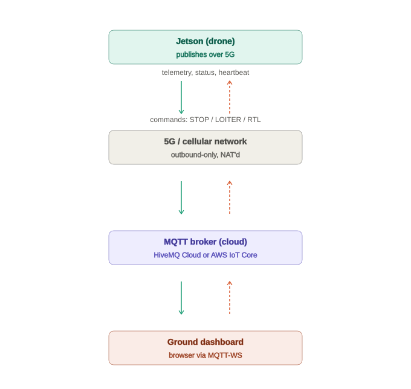
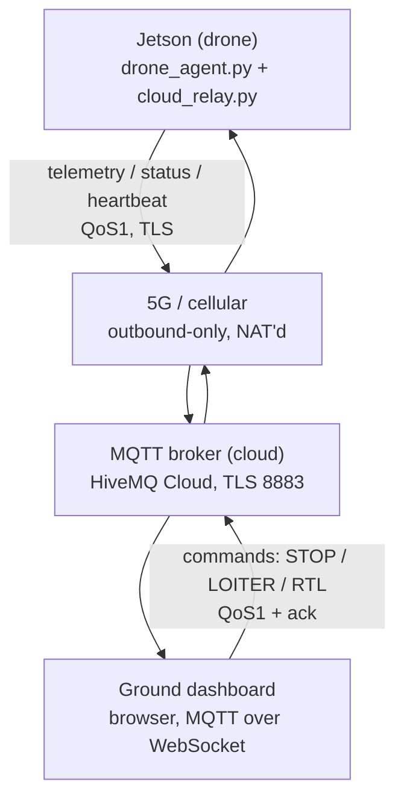

# WildNav — cloud telemetry & command relay (5G)

Extends the existing local-WiFi ground control layer (`server/drone_agent.py`,
`web/`) with a cloud path so an operator can monitor **and control** the
drone over 5G cellular when it's beyond WiFi range. This document is the
design record for that relay — not the existing local WiFi flow, which is
unchanged and documented in the top-level [README.md](../README.md).

## 1. Goal

- Stream drone telemetry to the cloud continuously over 5G.
- Stream the drone-side terminal/log output (what today only appears in
  `server/webui_logs/` and the local event-log stream) to the cloud too, so
  it's visible without SSHing into the Jetson.
- Let an operator view live telemetry and logs on a web dashboard from
  anywhere (v1: view-only — see §4 scope).
- Let that operator issue flight commands (STOP / LOITER / RTL) back to the
  drone mid-flight over the same cloud path (v2, designed in §6, not built
  yet).
- Keep cost near zero and latency low for a 1-3 drone fleet.

## 2. Relationship to the existing local WiFi GCS

| | Local WiFi (existing) | Cloud / 5G (this design) |
|---|---|---|
| Range | Same WiFi network only | Anywhere with cellular coverage |
| Transport | HTTP + WebSocket, `drone_agent.py` serves both | MQTT over TLS, via a cloud broker |
| Use case | Pre-flight setup, mission upload, local testing | In-flight monitoring & control, BVLOS |
| Reachability | Jetson runs its own server, operator connects in | Jetson is behind carrier NAT — it can only push out, nothing can dial in |

Both paths coexist. WiFi stays the tool for heavy local operations (GeoTIFF
upload, setup). The cloud path is additive, driven by a new `cloud_relay.py`
on the Jetson that taps the same telemetry events already feeding the local
WebSocket.

## 3. Architecture overview





A rendered version of this flow (with color-coded directions) was shared in
chat; the Mermaid block above is the portable copy that renders in GitHub/VS
Code.

**Dashboard hosting — corrected from the initial implementation, twice.**
`web/cloud.html` was first served by `drone_agent.py` itself (`GET
/cloud.html`), which meant loading the *page* still required being on the
drone's local WiFi even though the MQTT connection it makes is
internet-capable — defeating "access from anywhere." First fix attempt
deployed the whole `web/` folder to a static host with a `_redirects` rule
routing `/` to `cloud.html` — but `web/index.html` (the local mission-control
app) sitting alongside it at the same site root made that fragile in
practice (the redirect rule didn't reliably apply). Landed on: a dedicated
top-level **`dashboard/`** folder containing only `index.html` +
`static/{app.css,cloud.js}`, wholly separate from `web/` — its root page
just *is* the dashboard, no redirect rule needed. Deployed as a standalone
static site (Netlify, GitHub Pages, etc.) — see
[JETSON_SETUP.md](JETSON_SETUP.md) §5. `web/cloud.html` (served by
`drone_agent.py`) still exists as a local-WiFi fallback; `dashboard/` is the
one meant for real use.

The core constraint driving this shape: **the Jetson's 5G connection is
outbound-only** (carrier NAT, no public IP), so nothing can push data or
commands *into* it via a listening server. Everything has to be a push
through a broker both sides dial out to. This rules out exposing
`drone_agent.py` directly to the internet — MQTT pub/sub is the fit.

## 4. Key decisions log

| Decision | Choice | Why |
|---|---|---|
| Broker | HiveMQ Cloud free tier by default; AWS IoT Core supported as a pluggable alternative | `cloud_relay.py` is a plain MQTT/TLS client — broker choice is a config value, not an architecture change. Default wins on cost; AWS is there for teams already on AWS |
| Scope (full design) | Telemetry **and** full command/control over cloud | Operator needs to issue STOP/LOITER/RTL mid-flight, not just observe |
| **Scope (v1 implementation)** | **Monitoring only: telemetry + terminal/log output.** Command channel (§6) is designed but deferred to v2 | Get the one-way pipeline flowing and proven reliable before adding a safety-critical command path |
| History | Live only, no persistence (v1) | Simplest MVP; broker fans out live data directly, no DB needed yet |
| Fleet size target | 1-3 drones | Sizes the broker tier and topic design; revisit if scaling to a fleet |
| Link-loss policy | Mission continues autonomously; no cloud-triggered auto-RTL | Explicit choice — the flight controller's own failsafes (battery, geofence) remain the backstop underneath this layer regardless |
| Connectivity hardware | 5G unit already mounted on the drone, exposed to the Jetson as a WiFi hotspot | Jetson has continuous internet over a plain WiFi interface — no modem integration needed on the Jetson itself (see §9) |
| Coverage assumption | Good coverage (semi-urban / known test range) | Confirmed — de-risks the "no auto-action on link loss" policy above |

## 5. Communication protocol

### 5.1 Transport (MQTT)

- **TLS on 8883** — non-negotiable over public cellular.
- **QoS 1** for everything (at-least-once). QoS 2 is unneeded overhead;
  QoS 0 risks silent drops exactly when the link is weakest.
- **Persistent session** (`clean_session=False`), stable client ID per
  drone — queued QoS1 messages replay after a reconnect instead of vanishing.
- **Keepalive 15-20s** — short, because cellular NAT/carrier middleboxes can
  silently kill an idle TCP connection well before typical MQTT defaults.
- **Last Will and Testament** on connect: broker publishes a retained
  `offline` message on `.../lwt` if the drone's connection drops uncleanly —
  the cheapest, fastest "lost link" signal available.

### 5.2 Topic structure — as implemented (v1)

```
wildnav/<drone_id>/events   QoS1, retained=false   — telemetry + all log/event lines
wildnav/<drone_id>/status   QoS1, retained=true    — periodic heartbeat, 5Hz
wildnav/<drone_id>/lwt      retained                — broker-set offline marker
wildnav/<drone_id>/mission  QoS1, retained=true    — waypoints + mode for the active mission
```

**This differs from the original speculative schema above** (§5.3 previously
proposed a flat `lat/lon/battery_pct/mode` telemetry topic) — once
`cloud_relay.py` was actually wired up, the real telemetry turned out to be
heterogeneous, phase-dependent dicts already produced by `flight_engine.py`
(different fields for `takeoff`/`nav`/`landing` phases, no `battery_pct` at
all — MAVLink `BATTERY_STATUS` isn't read anywhere upstream yet). Rather than
force a schema that doesn't match reality, **every event `drone_agent.py`
already sends to the local WebSocket — telemetry, setup-script output, tool
logs, mission state changes — is forwarded verbatim to `.../events`**,
wrapped in a thin envelope. `cmd`/`cmd_ack` are not implemented in v1 (see §4
scope — monitoring only for now); §6 below still documents the intended
design for when that's built.

Retained `status` means a dashboard connecting mid-flight gets a "drone is
alive" signal within 5s, without waiting for the next telemetry tick.

### 5.3 Payload schema — as implemented

**`events`** — one message per event, whatever `kind` it is:
```json
{
  "ts": 1786686303.7159927,
  "seq": 6,
  "event": { "kind": "telem", "phase": "nav", "leg": 2, "total_legs": 3,
             "agl_m": 121.0, "dist_to_target_m": 250.0, "cte_m": 4.2,
             "heading_deg": 88.0 }
}
```
`event` is exactly what `drone_agent.py`'s local WebSocket already sends —
`kind` is one of `telem`, `setup_log`, `setup_start`, `setup_complete`,
`engine_start`, `takeoff_complete`, `waypoint_reached`, `mission_complete`,
`abort`, `tool_log`, `heartbeat`, or **`proc_log`** (new: a captured line of
this process's own stdout/stderr — see below). The dashboard's
`web/static/cloud.js` mirrors `web/static/app.js`'s existing `formatEvent()`
switch, since both render the same vocabulary.

**`status`**
```json
{ "status": "online", "ts": 1786686301.7138147 }
```

**Terminal/log output — what's actually captured, and what deliberately
isn't:**
- Structured events (`setup_log`, `tool_log`, mission state) already flowed
  through `RUNNER.event_q`/`TRT.log_q` locally — these ride the same path to
  the cloud with no new code needed on the producing side.
- `cloud_relay.py` additionally wraps the **agent process's own**
  `sys.stdout`/`sys.stderr` (`kind: "proc_log"`) so prints/tracebacks in
  `drone_agent.py` itself are visible without SSH.
- **Deliberately NOT captured**: `flight_engine.py`'s `_log_raw()` — a
  high-rate per-frame debug dump that the codebase already keeps out of the
  local WebSocket (`_mission_worker` runs in its own process; the mission
  subprocess explicitly restores real stdio before importing `flight_engine`,
  undoing the parent's Tee — see `cloud_relay.restore_std_streams()`). Piping
  that firehose to a metered cloud broker would work directly against the
  low-cost goal in §1, so this preserves the existing flood-control decision
  rather than accidentally bypassing it via the new stdout capture.

No `seq`/`ts` gap detection or protobuf/msgpack needed yet — payloads are
still small, single-digit Hz.

## 6. Command & control design

Because commands now control the aircraft mid-flight, this channel is
safety-critical — a lost STOP or a spoofed RTL both being real risk. Two
topics keep "sent" and "confirmed" distinct:

**`cmd`** (ground → drone)
```json
{
  "cmd_id": "c-000123",
  "ts": "2026-08-08T10:16:01.000Z",
  "action": "RTL",
  "issued_by": "operator@dashboard"
}
```

**`cmd_ack`** (drone → ground)
```json
{
  "cmd_id": "c-000123",
  "ts": "2026-08-08T10:16:01.310Z",
  "status": "done",
  "detail": "RTL engaged"
}
```
`status` is one of `received | executing | done | rejected`.

Design rules:
- **Ack loop is mandatory.** MQTT QoS only guarantees broker↔client
  delivery, not that `flight_engine.py` executed the command. The dashboard
  shows a command as *pending* until `cmd_ack` arrives, and flags it if no
  ack lands within ~2-3s (a healthy round trip is well under 500ms).
- **Sequencing & staleness.** Every command carries `cmd_id` + `ts`. The
  drone ignores a command older than the last one it already applied —
  prevents a command queued during a dropped session from firing late and
  overriding a newer instruction.
- **Safety commands are the exception to staleness.** STOP / LOITER / RTL
  are idempotent and always honored even if delayed — worst case is a
  redundant safe action, never a harmful one.
- **Latency expectation:** this is a supervisory link (discrete state
  changes), not manual control. Typical round trip (5G up + broker + 5G
  down) is ~100-300ms on good coverage, up to 1-2s on poor coverage — never
  intended to carry raw stick input.

## 7. Reliability & failure handling

- **Local backlog buffer**: `cloud_relay.py` writes every outgoing message
  to a SQLite ring buffer before/while publishing. On reconnect it drains
  oldest-first, capped by age (e.g. last 5 minutes) — a long outage
  shouldn't dump a flood of stale positions onto a live map.
- **Exponential backoff reconnect** (1s → 2s → 4s … capped ~30s) — avoids
  hammering the broker or draining battery on a bad cell.
- **Link-loss policy (explicit)**: if the drone can't reach the cloud, the
  mission already loaded in `flight_engine.py` continues unmodified. No
  cloud-triggered auto-RTL. The flight controller's own independent
  failsafes (battery, geofence, RC-loss if applicable) are unaffected by
  cloud status either way — this layer is purely an additional override
  channel, and losing it degrades to "no remote override," not "no
  failsafes."

## 8. Security

- Per-drone **client certificates** (not shared username/password),
  especially for the `cmd` topic.
- Broker **ACLs**: a drone may only publish to its own
  `wildnav/<id>/telemetry|status|cmd_ack` and subscribe only to its own
  `wildnav/<id>/cmd`. The dashboard's credential is scoped to
  subscribe-only on telemetry/status/lwt across the fleet, and publish-only
  on `cmd` for drones it's authorized to control.
- Consider an **application-level signature** (HMAC with a pre-shared
  per-drone key) on commands specifically, so the drone verifies command
  authenticity independent of broker auth — defense in depth if the broker
  account itself is ever compromised.

## 9. Modem & networking (Jetson side)

**Superseded by actual hardware.** The Jetson doesn't own cellular hardware
directly — a separate 5G unit is already mounted on the drone and exposes
itself to the Jetson as a WiFi access point/hotspot. The Jetson just joins
that WiFi network like any other, and gets internet through it continuously
(ground and airborne) — no ModemManager, QMI/MBIM, or USB modem integration
needed on the Jetson at all. What stays true from the original design:

- **Still outbound-only from the drone's perspective.** The 5G unit's own
  cellular uplink is carrier-NAT'd, so the Jetson still can't be dialed into
  from the internet — the push-based MQTT design (§3) is unchanged and still
  the right shape.
- **`cloud_relay.py` treats it as a normal network interface** (`wlan0` or
  similar) — no special binding needed unless the Jetson is later also
  running a *second*, separate local WiFi AP for on-field operator access,
  in which case bind the MQTT socket to the internet-facing interface
  specifically (`SO_BINDTODEVICE`) so it's never accidentally attempted over
  the wrong one.
- **Reconnect handling still lives in `cloud_relay.py`**, not in a modem
  watchdog — the WiFi link to the 5G unit (or the unit's own cellular
  uplink) can still drop even though neither is managed by the Jetson
  directly. The exponential-backoff reconnect logic in §7 covers this either
  way.
- **Clock sync**: `chrony` synced over this link once connected, with the
  flight controller's GPS time (MAVLink `SYSTEM_TIME`) as a fallback —
  needed for the `ts` fields in every payload to be meaningful.
- **SIM plan / coverage tuning** is now entirely the 5G unit's concern, not
  the Jetson's — outside this document's scope.

## 10. Cloud broker & cost

At 1-3 drones publishing telemetry continuously:

| Broker | Billing model | Estimated cost |
|---|---|---|
| HiveMQ Cloud (free tier) | Connections + traffic (100 connections, 10GB/mo free) | **$0/month** — well within free tier |
| EMQX Cloud Serverless | Session-minutes + traffic (1M session-min/mo free) | **$0/month** — well within free tier |
| AWS IoT Core | $1/million messages + connectivity | **~$15-40/month** at 1-3 drones (5Hz status heartbeat alone runs ~13M msg/mo per drone; more while telemetry is also flowing during a mission) |

**Default: HiveMQ Cloud free tier.** No cloud lock-in, and `mqtt.js` in the
browser makes the dashboard side trivial.

**Alternative: AWS IoT Core.** Nothing in this design is HiveMQ-specific —
`cloud_relay.py` talks plain MQTT over TLS, so swapping the broker is a
config/credential change (endpoint, auth, root CA), not a redesign. Worth
picking AWS instead if:
- The rest of the stack is already on AWS (Lambda for command processing,
  Timestream/DynamoDB if historical storage gets added later, IAM for
  unified access control across the org).
- Fleet-management tooling matters more than the ~$15-40/month difference —
  IoT Core's device registry, fleet indexing, and Device Defender give more
  built-in device-management surface than a bare MQTT broker.

What changes if AWS is picked:
- **Auth**: IoT Core expects X.509 client certificates per device by
  default (matches the per-drone cert plan in §8 already), rather than
  HiveMQ's simpler username/password option.
- **ACLs**: expressed as IAM/IoT policies (JSON documents scoping a
  certificate to specific topic ARNs) instead of HiveMQ's topic-permission
  UI — same effect (drone can only touch its own topics), different config
  surface.
- **Cost**: scales with message rate (§4), not connections — worth
  re-checking if the fleet grows well past 1-3 drones or the telemetry rate
  increases substantially.

## 11. Non-goals (v1)

- Video/imagery over the cloud link — telemetry only; video would need a
  separate pipeline (e.g. WebRTC), not MQTT.
- Historical playback / time-series storage — live view only for now.
- Multi-carrier / dual-SIM failover — deferred given the "good coverage
  expected" assumption; the upgrade path is kept open (see §9).
- Cloud-triggered auto-RTL on link loss — explicitly decided against (§4).

## 12. Implementation status

**Built and verified** (end-to-end tested against a live public MQTT broker,
plaintext and TLS, before any real credentials existed):
- `server/event_bus.py` — in-process pub/sub fan-out so the local WebSocket
  and `cloud_relay.py` each see every event without racing to drain the same
  single-consumer `mp.Queue`/list (`RUNNER.event_q`, `TRT.log_q`).
- `server/cloud_relay.py` — connects, publishes `events`/`status`/`lwt`,
  captures this process's stdout/stderr, reconnects with backoff. No-ops
  safely if `WILDNAV_MQTT_HOST` isn't set — existing local-only deployments
  are unaffected, and `paho-mqtt` is only imported lazily inside `start()`.
- `server/drone_agent.py` — wired up: central `_event_pump()` task, `/ws`
  now subscribes to the bus instead of draining `RUNNER`/`TRT` directly,
  `cloud_relay.relay.start()`/`.stop()` on FastAPI startup/shutdown,
  `restore_std_streams()` called at the top of `_mission_worker` (see §5.3).
- `web/cloud.html` + `web/static/cloud.js`, and the standalone
  `dashboard/index.html` + `dashboard/static/{app.css,cloud.js}` deployed to
  Netlify — connect via MQTT-over-WebSocket (`mqtt.js`), reuse `app.css`,
  mirror `app.js`'s event-formatting logic.
- `install.sh` — `paho-mqtt` added to `PIP_PKGS` and the post-install check.
- **Map panel**: Leaflet.js + Esri World Imagery (free, no API key) plotting
  live GPS position, EKF-estimated position (with a trail), and mission
  waypoints. Waypoints reach the cloud via a new `mission_config` event
  published by `drone_agent.py`'s `/api/start` handler (waypoints previously
  never left that endpoint — telemetry only carries live position, not the
  plan it's flying against) — `cloud_relay.py` retain-publishes it to
  `wildnav/<id>/mission` (§5.2) so a dashboard connecting mid-mission gets
  the waypoints immediately, same pattern as `status`/`lwt`.

**Deployed and confirmed working on real hardware** (Jetson Orin, HiveMQ
Cloud free tier, live flight-mode telemetry) — not just simulated against a
public test broker. Real issues hit and fixed along the way: a missing
`/cloud.html` route, a stale-retained-LWT bug (fixed with a birth/death
message pattern), silent connection failures (added `on_log` + a connect
watchdog), and a DNS resolution problem specific to the deployment network
(fixed at the OS level, outside this codebase).

**Config** (env vars read by `cloud_relay.py`, unset = disabled):
`WILDNAV_MQTT_HOST`, `WILDNAV_MQTT_PORT` (default 8883), `WILDNAV_MQTT_USERNAME`,
`WILDNAV_MQTT_PASSWORD`, `WILDNAV_DRONE_ID` (defaults to the agent's `--name`).

**Still open:**
- Command channel (§6) — deferred to v2 per the explicit v1 scope decision.
- Historical storage, multi-drone fleet dashboard polish — later, per §11.
- Shipping the actual mission GeoTIFF for exact-match imagery instead of
  generic satellite tiles — deliberately skipped, see the map panel note
  above and the original tradeoff discussion in chat.
